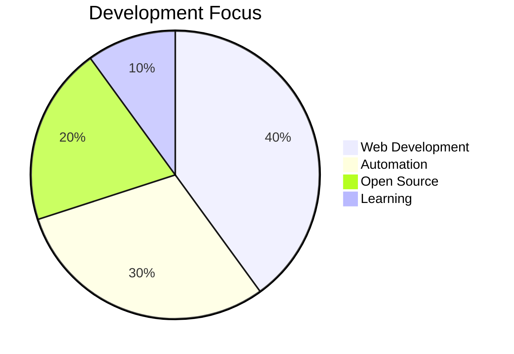

<div align="center">
  
</div>

<div align="center">
  
</div>

<div align="center">
  
</div>

## 🎯 About Me

```python
class SunilKumar:
    def __init__(self):
        self.name = "Sunil Kumar"
        self.role = "Full Stack Developer"
        self.location = "Ludhiana, India"
        self.timezone = "IST"
        self.passion = ["Web Development", "Automation", "Open Source"]
        
    def code(self):
        return "Building scalable applications with modern technologies"
        
    def contribute(self):
        return "Active Drupal contributor and open source enthusiast"
        
    def collaborate(self):
        return "Always open to exciting projects and collaborations"
```

<div align="center">
  
</div>

## 🛠️ Tech Arsenal

<table>
<tr>
<td align="center" width="33%">
  
### 🎨 Frontend


</td>
<td align="center" width="33%">

### ⚙️ Backend


</td>
<td align="center" width="33%">

### 🗄️ Database & Tools


</td>
</tr>
</table>

<div align="center">
  
</div>

## 🎯 Expertise Areas

<div align="center">
  
  
  
</div>



## 🌟 Open Source Contributions

<div align="center">
  <h3>🚀 Drupal Community Contributions</h3>
</div>

<table>
<tr>
<td align="center" width="50%">
  
### 📊 Error Reporting Module
[](https://www.drupal.org/project/error_reporting)
**Enhanced error handling and reporting capabilities**

</td>
<td align="center" width="50%">

### 🔐 Menu Item Group Role Access
[](https://www.drupal.org/project/menu_item_group_role_access)
**Advanced menu access control based on user roles**

</td>
</tr>
</table>

## 📊 GitHub Analytics

<div align="center">
  
</div>

<div align="center">
  
</div>

<div align="center">
  
</div>

<div align="center">
  
</div>

<div align="center">
  
</div>

## 🤝 Let's Connect & Collaborate

<div align="center">
  <h3>💬 Reach Out To Me</h3>
</div>

<div align="center">
  <a href="https://linkedin.com/in/sunil-kumar-553764240">
    
  </a>
  <a href="https://instagram.com/sunil.ldh777">
    
  </a>
  <a href="mailto:sunil31725@gmail.com">
    
  </a>
</div>

## 🚀 Collaboration Opportunities

<div align="center">
  
</div>

<table>
<tr>
<td align="center" width="25%">
  
### 🌐 Web Development
Full-stack applications
Modern frameworks
Responsive design

</td>
<td align="center" width="25%">

### 🤖 Automation
Workflow automation
Process optimization
Custom solutions

</td>
<td align="center" width="25%">

### 🔓 Open Source
Drupal contributions
Community projects
Code reviews

</td>
<td align="center" width="25%">

### 📚 Learning
Knowledge sharing
Mentoring
Tech discussions

</td>
</tr>
</table>

## 📍 Location & Availability

<div align="center">
  
  
  
</div>

---

<div align="center">
  
</div>

<div align="center">
  <h3>💡 "Building the web, one commit at a time"</h3>
  <p>Made with ❤️ by Sunil Kumar</p>
</div>
